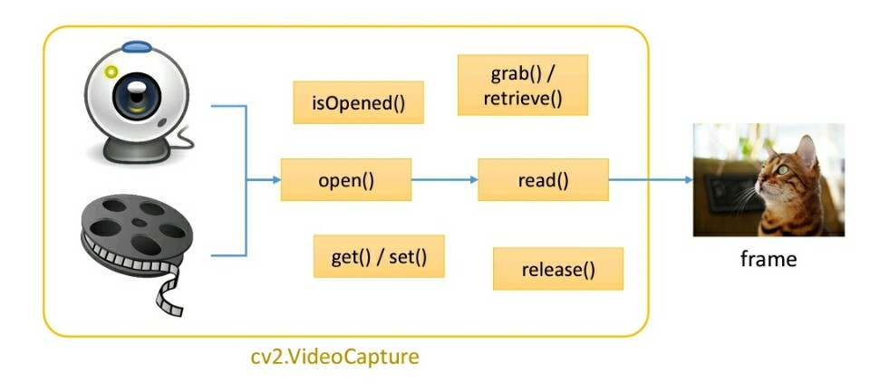

# Ch2 OpenCV-Python 기초 사용법 05 카메라와 동영상 처리하기

## cv2.VidepCapture 클래스

 - 이 클래스를 사용하여 카메라와 비디오를 control함.

 - openCV에서는 카메라와 동영상으로부터 프레임(Frame)을 받아오는 작업을 cv2.VideoCapture 클래스 하나로 처리한다. 

  

 <cv2.VideoCapture> 
 - 동영상 파일을 다룬다는 의미는, 여러가지 코덱으로 압축되어있는 동영상 파일을 파싱해서 일련의 프레임을 받아오는 작업
 - opencv 에서는 VideoCapture라는 Class하나를 만들고, open이라는 함수가 카메라를 또는 동영상 파일을 연다.
 - read()라는 함수를 이용해서 현재 frame을 계속 받아오는 작업을 함. ndarray 로 받는다.
 - isOpened() : 동영상 또는 카메라가 정삭적으로 열려있는지 확인하는 함수.
 - get()/set() : 동영상 또는 카메라로부터 정보를 받아오거나 정보를 쓰는 함수.
 - read() 함수 대린 grab()/retrieve() 같은 좀 더 Low level함수를 사용할 수 있음.
 - release() 를 이용해서 할당된 작업을 해제함.  

## 카메라 열기
 - cv2.VideoCapture(index,apiPreference=None) -> retval
     - index : camera_id+domain_offset_id  
       시스템 기본 카메라를 기본 방법으로(장치관리자에 등록되어있는 순서) 열려면 index에 0을 전달. 
       camera_id : 0부터 시작하는 정수값을 넣어준다. 
       ex) 2대가 있으면 1대는 0 1대는 1임. 
       domain_offset_id : 기본=0, 운영체제가 camera를 open하는 방법을 선택.
            
     - apiPreference : 선호하는 카메라 처리 방법을 지정.
     - retval : cv2.VodeoCapture 객체\n",
 - cv2.VideoCapture.open(index,apiPreference=None)->\n",
     - retval : 성공하면 True, 실패하면 False.\n",
    
## 비디오 캡쳐가 준비되었는지 확인

 - camera가 정상적으로 열렸는지 확인.
 - cv2.videoCapture.isOpened() -> retval
     - retval : 성공하면  True, 실패하면 False
    
## 프레임 받아오기.

    - cv2.VideoCapture.read(img=None)-> retval,image
        - for while응 이용하여 연속적인 frame 을 받아온다.
        - retval : 성공하면 True, 실패하면 False
        - image : 현재 프레임 (numpy.ndarray)

## 카메라, 비디오 장치 속성 값 참조

    - cv2.VideoCapture.get(propId)->retval
      - propId : 속성 상수. 
      |CAP_PROP_