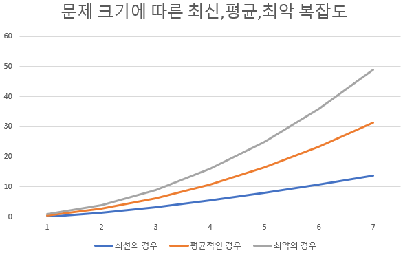

# <빅오, 자료형>

- big-O (빅오)
  - 입력값이 커질 때 알고리즘의 실행 시간(시간 복잡도)과 함께 공간 요구사항(공간 복잡도)이 어떨게 증가하는지를 분류하는데 사용
  - 알고리즘의 효률성을 분석하는데 유용하게 활용됨
- 학습 할 내용
  - 빅오의 개념
  - 시간 복잡도를 분석할 때 '상한'과 '최악'의 경우에 대해 혼동하는 부분
  - 불할 상환: 함수의 동작을 설명하는 매우 중요한 방법 중 하나
  - 파이썬의 자료형
  - 파이썬 자료형의 특징

## 1. 빅오
### (1) 빅오
- 빅오는 점근전 실행 시간(Asymptotic Running Time)을 표기할 때 가장 널리쓰이는 수학적 표기 중 하나.
- 점근전 실행 시간(Asymptotic Running Time) : 입력값 n이 커질 때 (입력값이 무한대를 향할 때) 함수의 싱행 시간의 추이
- 충분이 큰 입력에서는 알고리즘의 효율성에 따라 수행 시간이 크게 차이다 날 수 있다.
- 점근적 실행시간은 시간 복잡도라고 할 수 있다.
- 시간 복잡도(Time Cimplexity) : 어떤 알고리즘을 수행하는데 걸리는 시간을 설명하는 계산 복잡도(Computational Complexity)
- 계산 복잡도를 표기하는 대표적 방법이 빅오 이다.
- 시간 복잡도를 표기할 때에는 **입력값에 따른 알고리즘의 실행 시간의 추이만 고려한다**
- 빅오로 시간 복잡도를 표기할 때에는 최고차항만을 표기한다.(상수항 무시)
  - 4n^2+3n+4 의 경우 상수 무시, 최고차항만 고려하여 n^2만을 표기한다.
  - 이 경우 시간복잡도는 O(n^2)이 된다.
- **추이에 따른 빅오 표기법 종류**
  - O(1) :
    - 입력값이 커져도 실행시간이 일정 (상수의 시간을 갖는다)
    - 해시 테이블 조회 및 삽입이 해당됨
  - O(log n) :
    - 로그는 매우 큰 입력값에도 완만한 기울기를 갖는다.
    - 이진검생이 해당됨
  - O(n) :
    - 입력값과 비례하게 실행 시간이 영향을 받음.
    - 이러한 알고리즘을 선혛 시간(Linear-Time)알고리즘 이라고 한다.
    - 정렬되지 않은 리스트에서 max 또는 min의 경우가 해당됨.
    - 모든 입력값을 적어도 한번 이상은 살펴봐야 한다.
  - O(nlog n) : 
    - 병합 정렬 등 대부분 효율 좋은 정렬 알고리즘이 해당됨.
  - O(n^2) : 
    - 버블정렬 같은 비효율적인 정렬 알고리즘이 해당됨.
  - O(2^n) : 
    - 피보나치 수 를 재귀로 계산하는 알고리즘이 해당됨
  - O(n!) :
    - 각 도시를 방문하고 돌아오는 가장 짧은 경로를 찾는 외판원문제(Travelling Salesman Problem_TSP)를 브루트 포스로 풀이할 때가 이에 해당됨.
    - 가장 느린 알고리즘이다.
- 빅오는 시간 복잡도 외에 공감 복잡도를 표현하는 데이도 널리 쓰인다.
- 알고리즘은 '시간과 공간이 트에이드오프(Space-Time Tradeoff) 관계다.
  - 실행 시간이 빠른 알고리즘은 공간을 많이 사용하고, 공간을 적에 차지하는 알고리즘을 실행 시간이 느리다.

### (2) 상한과 최악
</br>
- 빅오(O)는 상한(Upper Bound)을 의미   


- 빅오메가(Ω)는 하한(Lower Bound)를 의미


- 빅세타(θ)는 평균을 의미
  - 학계와 달리 업계에서는 빅세타와 빅오를 하나로 합쳐 다순화해서    표현하려는 경향이 있음.


- **<U>상한을 최악의 경우와 혼동하는 경우</U>**
  -  빅오 표기법은 복잡한 함수를 '적당히 정확하게' 표현하는 방법일 뿐, <U>최악의 경우/평균적인 경우의 시간 복잡도와는 아무런 관계가 없는 개념.</U>
  - **<(EX) 최대/평균/최악의 경우의 개념>**

    - N=4일 때 최선의 경우에 비해 최악의 경우 약 3배 이상의 연산이 필요하다.
    - 퀵 정렬의 로무도 파티션(Lomuto Partition)의 경우
      - Lomuto Partition : 피벗을 정할 때 가장 우측을 책하는 가장 단순한 치벗 선택 방식)
      - 입력값이 [1,4,3,7,8,6,5] 일 때, 이 입력값은 "최선의 경우" 에 해당됨.
        - 이 경우 모두 정령하기 위해 18번의 비교 또는 스왑 연산이 필요하다. n=7 이므로 O(nlog(n))에 가깝다.
      - 입력값이 [1,2,3,4,5,6,7]일 경우 "최악의 경우" 에 해당됨.
        - 이 경우 48번의 연산을 수행하며 7*7=49 이므로 O(n^2)에 가깝다.
      - n=7 일 때 최선,평균,최악의 연산 횟수는 각각 18,24,48이며 빅오와는 관련이 없는 개념이다.
  - **<(EX) 빅오 표기의 개념>**

    - **빅오는** 위 그림과 같은 복잡한 함수 f(n)이 있을 경우, 이 함수의 실행 상한과 하한을 의미한다.
    - 가장 빨리 실행될 때 : 하한 (빅오메가Ω)
    - 가장 늦게 실행 될 때 : 상한 (빅오 O)
    - 평균적으 실행될 때 : 빅세타 (θ)
    - n0 : n이 작을 때를 말함. 이 경우는 무시한다.
    - 빅오 표기법은 n이 매우 클 때의 전체적인 큰 그림에 집중한다. 

- ### <빅오 표기법은 주어진(최선/최악/평균)경우의 수행 시간의 상한을 나타낸다!!>


- 퀵 정렬에서 "최선의 경우 O(nlog(n))이다" 라는 말은 입력값이 [1,4,3,7,8,5]일 때 '최대 연산'이 nlog(n) 이내라는 의미.
  - 7ln(7)=13.6 정도이며 최선의 경우 연산 횟수는 18이므로 상수항이 생략됨을 감안하면 비슷한 수치.
- "최선의 경우 O(n^2)이다" 라는 명제도 참이다.
  - 빅오는 상한을 의미하므로 실 연산 횟수가 이보다 작기만 하면 되기 때문.
- "최선의 경우 O(n^3)이다" 라는 명제도 참이다.
  - 하지만 이런 경우 상한을 지나치게 높게 설정했기 때문에 아무런 의미가 없다.
### (3) 분할 상환 분석
- 분할 상황 분석(Amortized Analysis) : 빅오와 함께 함수의 동작을 설명할 때 중요한 분석 방법 중 하나.
- 최악의 경우를 여러 번에 걸쳐 골고루 나눠주는 형태로 알고리즘의 시간 복잡도를 계산할 수 있다.
- 시간 복잡도를 분석할 때 매우 보편적으로 널리 사용됨.
# **분할 상환 분석 좀 더 공부해서 정리하기**

### (4) 병렬화
- 알고리즘 자체의 시간 복잡화 외에 알고리즘이 병렬화 가능성은 근래에 알고리즘 우수성을 평가하는 매우 중요한 척도 중 하나디아.

## 2. 자료형
### (1) 파이썬 자료형
<Python 3.7기준의 자료형>


#### - 숫자 (class float, class int, class bool)
- 파이썬에서는 숫자 정수형으로 int만을 제공한다.
- PEP 237 로드맵에 따라 버전3 부터 int단일형으로 통합됨
- 기본 정수형인 int가 임의 정밀도 연산까지 수행한다.
- 파이썬에서 고정 정밀도 정수형은 지원하지 않는다.(고정 정밀도 : C스타일의 int형과 같음)
- object > int > bool
  - int는 object의 하위 클래스이고, bool은 int의 서브 클래스 이다.
- bool은 논리자료형인데 (True==1, False==0) 내부적으로 정수값을 갖고있다.
- 임의정밀도란?
  - 무제한 자릿수를 제공하는 정수형
  - 자릿수 단위로 쪼개어 배열 형태로 표현한다.
#### - 매핑 (class dict)
- Mapping 타입 : 키와 자료형으로 구성된 복합 자료형
- 파이썬의 매핑타입의 자료형은 "딕셔너리" 이다.
#### - 집합 (class set)
- 파이썬의 집합 자료형인 set은 중복된 값을 갖지 않는 자료형.
- 집합 선언
```python
## 빈 집합 선언
>>> a=set() # 빈 집합 a 선언
>>> a
>>> type(a)
<<class 'set'>>

## 값이 포함된 집합 선언
>>> b={1,2,3} # value만 선언. 중괄호로 묶는다.
```
- set은 입력 순서가 유지되지 않으며, 중복값이 있을 경우 하나의 값만 유지한다.
```python
>>> a={3,2,3,5}
>>> a
{2,3,5}
```
#### - 시퀀스

